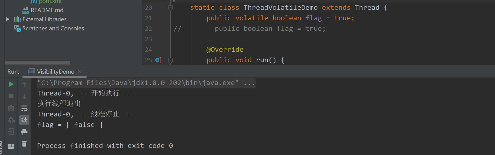

## 并发的问题

- CPU和内存之间是存在速度差异的（CPU的执行速度快于内存）。

  - 方法一：通过缓存一定程度上缓和了CPU和内存之间的速度矛盾。
  - 方法二：如果程序运行过程中减少和内存的交互，让CPU自己尽可能多的完成内容，那么一定程度上也能够起到减少两者的速度矛盾。

- 正是因为这些优化的产生，并发也就存在一些问题，

  ### 可见性问题

   `示例：Visibility Demo . java`

  ```ruby
  可见性是指，当一个线程对共享变量进行修改后，另外一个线程可以立即看到该变量修改后的最新值。
  
  但是，
  每个线程都会有一个线程的副本(也叫缓存)，这个缓存是指CPU中L1、L2、L3三级高速缓存，
  第一次会去主存中拿到值并且copy到每个线程的副本中，而后每个线程再去更改值或状态时，只会更改当前线程副本的值或状态，不会重新去主存读取最新的值或状态，
  那么就会导致一个线程更改了值或状态，另外一个线程无法得到最新的值或状态，就会使线程间不可见，这就是线程的可见性问题。
  ```

  - ```java
    package 并发的问题;
    
    /**
     * @author Inspiration.DW
     * 线程可见性
     */
    public class VisibilityDemo {
        public static void main(String[] args) throws InterruptedException {
            ThreadVolatileDemo threadVolatileDemo = new ThreadVolatileDemo();
            threadVolatileDemo.start();
    
            Thread.sleep(3000);
    
            threadVolatileDemo.setFlag(false);
    
            Thread.sleep(1000);
            System.out.println("flag = [ " + threadVolatileDemo.flag + " ]");
        }
    
        static class ThreadVolatileDemo extends Thread {
    //        public volatile boolean flag = true;
            public boolean flag = true;
    
            @Override
            public void run() {
                String name = Thread.currentThread().getName();
                System.out.println(name + ", == 开始执行 ==");
                while (true) {
                    // 决定是否结束循环
                    if (isFlag() == false) {
                        System.out.println("执行线程退出");
                        break;
                    }
                }
                System.out.println(name + ", == 线程停止 ==");
            }
    
            public boolean isFlag() {
                return flag;
            }
    
            public void setFlag(boolean flag) {
                this.flag = flag;
            }
        }
    
    }
    ```

  - 

  - **此时，flag的值已经更改为false，但是线程子线程依旧处于执行状态。也就是说，我这边更改了，但是那边根本不知道，这就是线程的可见性问题。**

  - **解决方案：`public volatile boolean flag = true;`**

  - 

  - **使用volatile修饰flag之后，就解决了线程的可见性问题。**

    ```
    volatile可以保证线程间的可见性
    volatile修饰引用类型时只能保证引用本身的可见性，不能保证内部字段的可见性
    ```

  - **总结：**可见性问题原因，当前程序处于多核的平台运行且存在缓存的情况下，多线程并发做变量更新时，线程与线程之间的变量，在主内存中并不是立即更新的，这就导致线程与线程之间的变量是不可见的。

  ### 原子性问题

  `示例：Atomicity Demo . java`

  ```ruby
  在一次或者多次操作时，要么所有操作都被执行，要么所有操作都不执行。
  
  举个例子：
  int count = 0;
  cout++; // 高级语言的一条指令
    这行语句对应CPU的执行指令：
  	1. count的值加载到CPU寄存器中；
  	2. 寄存器中做+1操作；
  	3. 结果写入到内存。
  此时，如果是线程A和线程B同时执行这条语句：
  线程A 执行第1步，阻塞；
  线程B 执行第1步，执行第2步，此时寄存器内的值为1
  线程A 执行第2步，此时寄存器内的值为2.
      这就出现问题了，count++执行结果出现了争议。
  这就破坏了原子性。
  如果可以保证count++不拆分，那么就保证1~3这个执行过程是不会被中断的，那么原子性的问题就解决了。
  ```

  - ```java
    package 并发的问题;
    
            /**
     * @author Inspiration.DW
     * 线程原子性
     */
    public class AtomicityDemo extends Thread {
        // 没有原子性
        private static int count;
    
        // 解决方式1
    //    private volatile static int count;
        // 解决方式2
    //    private static AtomicInteger count = new AtomicInteger(0);
    
        private static void addCount() {
            for (int i = 0; i < 1000; ++i) {
                count++;
    //            count += 1;
    //            count.incrementAndGet();
            }
            System.out.println(count);
        }
    
    
        @Override
        public void run() {
            addCount();
        }
    
    
        public static void main(String[] args) {
            int len = 10;
            // 10个线程
            AtomicityDemo[] arr = new AtomicityDemo[len];
    
            for (int i = 0; i < len; ++i) {
                // 初始化线程
                arr[i] = new AtomicityDemo();
            }
    
            for (int i = 0; i < len; i++) {
                // 开启线程
                arr[i].start();
            }
        }
    }
    
    ```

  - 

  - **正常，10个线程对静态变量count执行+1，应该是10000，但是现在最终结果却不是。**

  ### 有序性问题

  `示例：Reorder Demo . java`

  ```ruby
  有序性指的是：程序执行的顺序按照代码的先后顺序执行。
  
  在Java中，为了提高程序的运行效率，可能在编译期和运行期会对代码指令进行一定的优化(优化代码->优化性能)，不会百分之百的保证代码的执行顺序严格按照编写代码中的顺序执行，但也不是随意进行重排序，它会保证程序的最终运算结果是编码时所期望的。这种情况被称之为指令重排（Instruction Reordering）。
  ```

  - ```java
    package 并发的问题;
    
    /**
     * @author Inspiration.DW
     * 指令重排
     */
    public class ReorderDemo {
    
        static int x = 0, y = 0;
        static int a = 0, b = 0;
    
        public static void main(String[] args) throws InterruptedException {
            while (true) {
                reorder();
            }
        }
    
        static void reorder() throws InterruptedException{
            Thread t1 = new Thread(new Runnable() {
                public void run() {
                    /*操作1和操作2的执行先后关系无影响*/
                    a = 1; // 操作1
                    x = b; // 操作2
                }
            });
    
            Thread t2 = new Thread(new Runnable() {
                public void run() {
                    /*操作3和操作4的执行先后关系无影响*/
                    b = 1; // 操作3
                    y = a; // 操作4
                }
            });
            /*线程1和线程2整体考虑，线程内部的执行的先后关系就对结果有影响了*/
    
            t1.start();
            t2.start();
    
            // join方法是把其他线程加入当前线程，等加入线程执行完之后才会执行当前线程。
            t1.join();
            t2.join();
    
            // t1和t2执行完了，才会执行接下来的代码
    
            // 如果想要出现 x == 0 && y == 0，那么指令重排时，
            // 将操作2优化到操作1前面，操作4优化到操作3前面了。
            if (x == 0 && y == 0) {
                System.out.println("( " + x + "," + y + " )");
            }
    
            x = 0;
            y = 0;
            a = 0;
            b = 0;
        }
    }
    ```

  - 

  - **在执行时，编译器会对代码进行重排，就会导致不同的运行结果，这就导致了程序的不确定性，这就是个问题了。**

